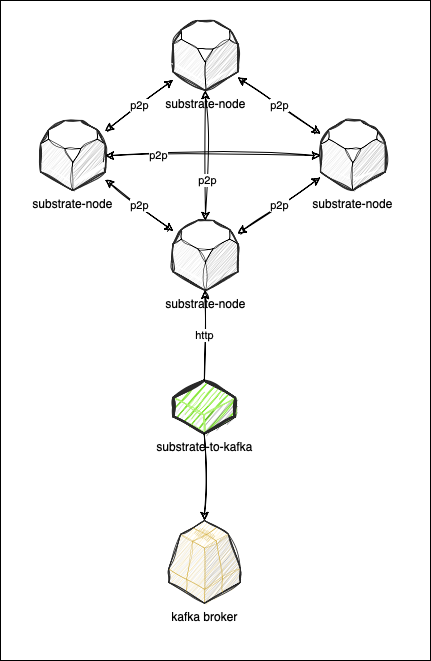

# substrate-to-kafka

Publish various substrate-based blockchain events to Kafka and let them be consumed asynchronously by downstream services.

### Running

`cargo run -- --substrate-node-url "wss://substrate-node"`